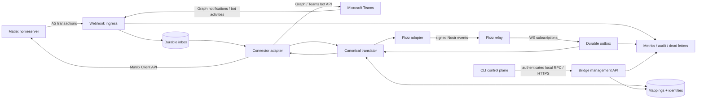

# External Collaboration Bridges

Status: proposed implementation groundwork (2026-08-11)

This document defines the shared foundation for connecting Pkzz channels to
external collaboration systems. Matrix is the protocol reference adapter;
Microsoft Teams is an explicit production target. Slack, Discord, IRC, and
other systems should be implementable without rebuilding identity mapping,
event translation, reliability, authorization, or observability each time.

This is not a commitment to mirror every feature of every system. It is an
implementation-ready boundary: build the common bridge substrate once, then
add adapters with explicit capabilities and deliberate degradations.

## Definition

A **Matrix bridge** is a protocol translator and identity gateway that makes a
Matrix room and a channel on another network behave like two views of a
connected conversation. For Pkzz:

```text
Matrix room                    Pkzz channel
#project:company.example  <->  #project
```

The bridge receives Matrix events, translates them into signed Nostr/Pkzz
events, and publishes them into the mapped Pkzz channel. In the other
direction, it subscribes to that Pkzz channel and translates eligible events
into Matrix room events.

A Microsoft Teams bridge follows the same model:

```text
Teams tenant / team / channel  <->  Pkzz community / channel
```

The connector-specific APIs differ, but the hard parts are shared:

- mapping rooms/channels and identities;
- preserving threads, mentions, edits, deletes, reactions, and media;
- avoiding loops and duplicate delivery;
- reconciling authorization models;
- storing credentials safely;
- recovering after webhook, relay, or process failure;
- exposing degradation instead of silently losing semantics.

## Product intent

Pkzz should remain a dependable team client while becoming the common
workspace where humans and agents can collaborate regardless of where the
humans currently work. A team should be able to keep using Matrix or Teams
while selected conversations are available to Pkzz users and agents.

The bridge must not turn Pkzz into a tenant-wide surveillance system or cause
all external messages to wake agents. Connections are explicit, scoped, and
auditable.

## Goals

1. Map an external room/channel to exactly one Pkzz channel per active bridge
   mapping.
2. Deliver text and thread relationships bidirectionally with at-least-once
   transport and effectively-once materialization.
3. Preserve external attribution without pretending a bot-authored event was
   cryptographically signed by the external human.
4. Keep connector credentials and opaque external identifiers out of public
   Nostr events unless a separately reviewed protocol requires them.
5. Make every lossy translation visible through connector capabilities,
   telemetry, and dead-letter records.
6. Keep the relay surface Nostr-first. External webhook endpoints belong to a
   bridge service, not to `buzz-relay`.
7. Make Matrix, Teams, and future connectors share the same core contracts,
   persistence model, Pkzz adapter, CLI, test suite, and operational model.

## Non-goals for the groundwork phase

- Bridging every room/channel in a tenant by default.
- End-to-end-encrypted Matrix rooms in the first pilot.
- Creating custodial Nostr keypairs for every external human in the first
  pilot.
- Perfect visual fidelity for Adaptive Cards, Matrix custom events, or every
  rich-text extension.
- Audio/video meeting bridging.
- Replacing Matrix federation, Microsoft Graph, or Teams bots.
- Giving an external platform authority to bypass Pkzz relay membership,
  moderation, or host-derived community boundaries.
- Adding a new public Pkzz event kind before the internal bridge envelope and
  private mapping store prove one is necessary.

## Design principles

### Deterministic and opt-in

A mapping is enabled by an administrator for one external location and one
Pkzz channel. No connector may infer additional mappings from similarly named
rooms, teams, channels, or users.

### Least privilege

A connection receives only the permissions required for its mapped locations.
For Teams, prefer resource-specific consent for a particular team/chat over
tenant-wide message permissions. For Matrix, register the narrowest practical
Application Service namespaces and room interests.

### Honest identity

A bridge service may attribute a message to an external person, but it must not
claim that the person signed the Pkzz event unless that identity has been
explicitly linked and the signing model has been reviewed. Service identity,
linked identity, and virtual/puppeted identity are distinct modes.

### Capability-driven translation

Every connector publishes a capability record. The core asks what is supported
before attempting edits, reactions, impersonation, encrypted rooms, or media.
Unsupported behavior is downgraded according to an explicit mapping policy or
sent to a dead-letter queue; it is never silently accepted and dropped.

### At-least-once transport, effectively-once effects

Matrix Application Services and Microsoft Graph notifications can retry. Nostr
subscriptions reconnect and replay. The bridge therefore assumes duplicate and
out-of-order input. Durable idempotency and mapping records—not process memory—
prevent duplicate user-visible effects.

### Pkzz authorization remains authoritative

The bridge publishes through a dedicated Nostr key that is a member of each
mapped channel. The relay applies the same host-derived community, NIP-29,
membership, moderation, kind, and size checks it applies to any other client.
The bridge never writes directly to `buzz-db`.

## Proposed architecture



### Process boundary

Run bridging as a standalone `buzz-bridge` service, not inside `buzz-relay`.
The service owns public webhook endpoints, external SDKs, connector retry
policy, subscription renewal, and external credentials. It talks to Pkzz
through existing protocol surfaces:

- `buzz-ws-client` for authenticated relay subscriptions/publication;
- `buzz-sdk` typed builders for Pkzz events;
- `buzz-core` for kind constants and shared validation types.

This keeps failures or dependencies in Microsoft Graph, Matrix SDKs, and future
connectors out of the relay's ingestion and fan-out path.

### Initial crate layout

Start with two crates rather than one crate per external system:

```text
crates/
  buzz-bridge-core/   # canonical types, capabilities, mapping/store contracts
  buzz-bridge/        # daemon, Pkzz adapter, Matrix/Teams modules, webhook server
```

Split connector crates later only if SDK dependency weight or independent
release cadence justifies it. `buzz-bridge-core` must not depend on Matrix,
Graph, HTTP-server, or relay implementation crates.

### Core connector contract

The exact Rust API should be ratified with fixtures before network adapters are
written. Conceptually:

```rust
pub trait BridgeConnector {
    fn connector_type(&self) -> ConnectorType;
    fn capabilities(&self) -> ConnectorCapabilities;
    fn validate_mapping(&self, mapping: &ChannelMapping) -> Result<(), BridgeError>;

    async fn send(&self, action: OutboundAction) -> Result<ExternalReceipt, BridgeError>;
    async fn reconcile(&self, cursor: ReconcileCursor) -> Result<ReconcilePage, BridgeError>;
    async fn health(&self) -> ConnectorHealth;
}
```

The daemon selects connectors at runtime, so the final interface must be
object-safe. The snippet is conceptual; the implementation should use the
workspace's approved async-trait/boxed-future pattern rather than assume native
`async fn` methods can be called through `dyn BridgeConnector`.

Inbound webhooks do not call `send` recursively. They validate authentication,
persist a canonical inbox record, acknowledge quickly, and let workers perform
translation.

### Connector capabilities

Capabilities should be data, not adapter-name conditionals:

```text
text
rich_text
threads
edits_own_messages
edits_external_messages
soft_delete_own_messages
reactions_inbound
reactions_outbound
mentions
media_upload
media_download
virtual_identities
linked_identities
typing
presence
end_to_end_encryption
history_reconciliation
```

Capabilities can also carry limits: maximum body bytes, attachment bytes,
mention count, supported content types, and subscription duration.

Capabilities are directional and can depend on identity mode. In particular,
service-identity mode does not advertise inbound reactions until Pkzz has an
actor-preserving representation; all external actors would otherwise sign as
one bridge pubkey.

## Canonical bridge envelope

External payloads are normalized before they touch Pkzz-specific translation.
A durable envelope should contain at least:

```text
connector_type          matrix | teams | ...
connection_id           internal stable UUID
external_location       room ID, or tenant/team/channel/chat composite
external_event_id       opaque ID scoped by location
external_revision       edit timestamp, etag, or connector sequence
operation               create | edit | delete | react | unreact
actor                    external stable ID + display snapshot
relation                 root/reply/target external IDs
body                     normalized text plus optional safe rich-text form
mentions                 external identity references
attachments              metadata and fetch handles, not unbounded bytes
occurred_at               source timestamp
received_at               bridge timestamp
source_cursor             transaction/subscription/reconciliation cursor
raw_schema_version        adapter parser version
```

Raw external payloads may be retained briefly for debugging according to an
explicit retention policy. They must not be logged by default because Teams or
Matrix messages may contain confidential content.

## Durable state

The first implementation should use a transactional store with these logical
tables:

| Table | Purpose | Required uniqueness |
|---|---|---|
| `pkzz_endpoints` | Trusted normalized relay URL/host, expected community identity, bridge signing-key secret reference | endpoint UUID; normalized relay host |
| `bridge_connections` | External connector type, tenant/homeserver, status, secret reference | connection UUID |
| `channel_mappings` | External location and Pkzz endpoint/channel plus policy | connection + external location; endpoint + Pkzz channel per active mapping policy |
| `identity_links` | Optional verified external identity to Pkzz pubkey | connection + external actor ID |
| `event_mappings` | External event/revision to Pkzz event and direction | connection + location + external event ID + revision; endpoint + Pkzz event ID |
| `inbox` | Validated inbound work, attempts, next retry | connector-specific idempotency key |
| `outbox` | Pkzz-origin outbound work and pending external receipt | mapping + Pkzz event ID + operation |
| `subscriptions` | Graph expiry/lifecycle data or Matrix cursor state | connection + resource |
| `dead_letters` | Terminal failures with redacted diagnostics | generated ID |
| `bridge_audit` | Configuration and delivery decisions | generated ID |

SQLite is acceptable for a single-instance pilot if the schema and store trait
do not assume SQLite-only behavior. A production multi-replica deployment
requires Postgres or a single-active lease. Do not run two active daemons over
one SQLite file.

Every mapping references a `pkzz_endpoints` row. The endpoint's normalized
relay host—not an external payload, display name, or free-form community
identifier—selects the host-derived Pkzz tenant. Connection setup verifies the
expected community identity against that host. A mapping cannot publish or
subscribe through a different host without an audited endpoint migration.

Secrets are referenced from `bridge_connections` and `pkzz_endpoints`, not
stored directly in ordinary configuration rows. Production secret material
belongs in an approved secret manager. Local development may use environment
variables or a restricted local secret file.

## Identity modes

### Service identity (recommended v1)

Each external connection uses a dedicated Nostr key and visible bridge profile,
for example `Teams Bridge — Engineering`. Inbound content includes honest,
interoperable attribution:

```text
Alice Nguyen (Teams)
Can Den review the deployment plan?
```

The event is signed by the bridge, not Alice. This works in generic Nostr
clients and avoids custodial per-user keys. A later Pkzz UI may render richer
attribution from reviewed metadata, but v1 must remain understandable without
that UI.

### Linked identity

An external identity can be linked to an existing Pkzz pubkey after an explicit
proof/approval flow. Linking allows mention translation and profile navigation;
it does not give the bridge the person's Nostr private key. The bridge still
signs imported messages with its service identity and records the linked actor
as attribution.

### Virtual or puppeted identity

Matrix Application Services can reserve local user namespaces and masquerade as
virtual users. A future Matrix adapter may create one Matrix ghost for each
Pkzz identity and, only after key-custody review, one Pkzz virtual identity for
an external user.

Teams normally represents connector output as an installed app/bot; general
message sending does not allow arbitrary `from` identities. Teams migration
APIs are not an impersonation mechanism for a live bridge.

Puppeting is deferred because it changes key custody, account lifecycle,
moderation, consent, and audit expectations.

## Agent addressing policy

External text that looks like `@Den` must not automatically become a Pkzz
`p` tag. A mapping has explicit policy:

```text
allow_agent_wake = false          # default
allowed_agent_pubkeys = [...]     # optional allowlist
```

Omitting a `p` tag is not sufficient enforcement: agents in `all`, `thread`, or
non-mention config modes can still react to any imported kind-9 event. The
dedicated bridge signer is therefore trusted provenance. Before engagement
matching, `buzz-acp` must apply a bridge-origin dispatch policy keyed by
`(relay host, channel id, bridge pubkey)` from trusted local/control-plane
configuration:

- `allow_agent_wake = false` drops bridge-origin events from agent turn
  dispatch in **all** engagement modes while leaving them visible to humans;
- `allow_agent_wake = true` admits only the mapping's allowed agent pubkeys;
  structured mention translation is still required before adding any `p` tag;
- unknown bridge signers default to no wake.

Until this dispatch gate exists, a pilot mapping may target only channels where
every listening agent requires explicit mentions, and the bridge must not emit
agent `p` tags.

An inbound mention becomes an agent-addressing `p` tag only when:

1. the external mention is a structured mention, not text matching;
2. the mentioned external identity is verified as linked to that Pkzz agent;
3. the mapping permits agent wake-up; and
4. the agent pubkey is allowed for the mapped channel.

Otherwise the mention remains attributed text and the ACP bridge-origin gate
suppresses it from agent turn dispatch. This preserves the engagement
principle: deterministic by default, experiments opt-in, and no external
platform can create an agent loop accidentally.

Outbound Pkzz mentions become native Matrix/Teams mentions only when a verified
identity link exists in that external location. Otherwise the adapter emits
plain display text without fabricating a mention target.

## Pkzz event translation

Timeline messages, edits, and NIP-29 moderation/delete events that require
explicit channel scope carry the `h` tag. Target-derived auxiliary events are
the intentional exception: kind-7 reactions and kind-5 reaction removals use
their `e` target, and relay ingest/filtering resolves the target's stored
channel. Addressable channel metadata continues to use its existing `d` tags.

Use existing `buzz-sdk` builders and current relay policy rather than hand-
assembling tags:

| Operation | Pkzz representation | Notes |
|---|---|---|
| Root message | `KIND_STREAM_MESSAGE` (`9`) | `h` tag for mapped channel; bridge signer |
| Reply | kind `9` plus `ThreadRef` NIP-10 `e` tags | Resolve external parent/root through `event_mappings` |
| Mention | `p` tag | Only under linked-identity and agent-wake policy |
| Edit | `KIND_STREAM_MESSAGE_EDIT` (`40003`) | Only for a mapped message the source is allowed to edit |
| Delete | `KIND_NIP29_DELETE_EVENT` (`9005`) plus existing compatibility policy | Kind 9005 carries `h`; target-derived kind-5 compatibility/removal events follow existing SDK policy |
| Reaction | `KIND_REACTION` (`7`) | Target-derived channel, no hand-added `h`; service-identity inbound reactions are disabled |
| Media | Existing Blossom/S3 media path and `imeta` tags | Enforce both systems' limits before transfer |
| Typing | `KIND_TYPING_INDICATOR` (`20002`) | Deferred/best effort; never durable bridge history |
| Presence | `KIND_PRESENCE_UPDATE` (`20001`) | Deferred; external semantics differ materially |

Do not put Teams tenant IDs, Matrix access tokens, full room IDs for private
rooms, or Graph subscription secrets into public event tags. Loop prevention
and external event lookup live in `event_mappings`.

## Translation behavior by feature

### Threads

The mapping store records root and parent counterparts. For inbound Teams
channel replies, `replyToId` points at the channel root. For Matrix, relation
metadata identifies replies/threads according to the room event content. The
Pkzz adapter resolves those IDs and emits canonical `ThreadRef` tags.

If the parent is unavailable:

- attempt bounded reconciliation;
- if the root is known, attach to the root and mark a degraded relation in
  telemetry;
- otherwise dead-letter or import as an explicitly attributed root according
  to mapping policy.

Never silently attach a reply to an unrelated recent message.

### Edits

Only propagate an edit when `event_mappings` proves the target counterpart.
An external user editing their source message can update the bridge-authored
Pkzz counterpart. A Pkzz user editing their source event can update the
bridge/bot-authored external counterpart if the connector permits it.

Microsoft Graph's general `chatMessage` update surface does not provide an
arbitrary live-message rewrite for all senders; Bot Framework can update
activities authored by the bot. The Teams connector therefore advertises
`edits_own_messages` only when its actual send transport returns an editable
activity/message receipt.

### Deletes

Delete only a mapped counterpart and retain the mapping tombstone so a replay
does not recreate the message. If an external API cannot remove the counterpart,
post no misleading success: mark the action unsupported or failed and expose it
in bridge status.

### Reactions

Pkzz identifies a reaction actor by the signing pubkey and stores one active
reaction per `(target, pubkey, emoji)`. Under service identity, Alice and Bob
would both sign as the same bridge key, so identical reactions would collapse
and attribution would be false. Inbound external reactions are therefore
unsupported/degraded in the v1 service-identity mode.

An adapter may advertise inbound reactions only after ratifying an
actor-preserving representation (for example, a reviewed virtual-identity
model or protocol change). Foundation fixtures include two external actors
using the same emoji and must prove that service mode reports an unsupported
capability rather than materializing one incorrect reaction. Outbound
reactions are independently capability-gated.

### Rich text

Normalize external HTML/Matrix formatted bodies through a strict sanitizer.
Keep a plain-text fallback. Do not pass external HTML directly into desktop
rendering. Outbound formatting starts from Pkzz Markdown and degrades through a
connector-specific safe subset.

### Media

Media transfer is a fetch-validate-store-publish pipeline:

1. authorize the source fetch;
2. stream with byte and time limits;
3. verify declared versus detected content type;
4. scan according to deployment policy;
5. store through the destination's supported media path;
6. publish only after a durable receipt exists.

Never embed long-lived Matrix, Graph, or Teams bearer tokens in media URLs.
Remote media fetched on demand must use a bridge-authenticated proxy with
strict SSRF protections or be copied into Pkzz-managed media storage.

## Loop prevention and idempotency

A bridge must survive these races:

- Matrix retries the same Application Service transaction;
- Graph sends duplicate or out-of-order change notifications;
- the relay replays events after reconnect;
- an outbound send succeeds but the process crashes before storing its receipt;
- the external echo arrives before the outbound worker stores the mapping;
- edits and reactions arrive before the root import finishes.

Required controls:

1. Connector-specific durable inbox keys derived from stable source semantics,
   never an assumed universal delivery ID.
2. Unique `event_mappings` keys scoped by connection and external location.
3. A dedicated bridge signer; its own Pkzz imports are never re-exported.
4. Transactional outbox records created before network sends.
5. Per-mapping ordered workers for relation-sensitive operations.
6. Pending-receipt reconciliation after ambiguous timeouts.
7. Tombstones retained after deletes.
8. No content-hash-only deduplication; two humans may send identical text.

Matrix's Application Service transaction ID is a first-class idempotency key.
Microsoft Graph change notifications do not carry a notification/delivery ID.
The Teams adapter keys effects by subscription, scoped resource identity,
change type, and a stable resource revision such as `etag`, modification time,
or deletion state obtained from encrypted resource data or reconciliation.
Graph may coalesce updates, so workers reconcile the latest state and advance a
monotonic mapped revision rather than assuming one webhook equals one edit.
Teams message IDs are only unique in their chat/channel/reply context, so every
resource key also includes tenant and external location.

## Authorization and security boundary

### Dedicated connection identity

Use a separate Nostr key per external connection or tightly scoped tenant. Add
that key only to mapped Pkzz channels. Do not reuse an agent's key, a human's
key, or the relay key.

### Webhook authentication

- Matrix: verify the homeserver bearer `hs_token` on every Application Service
  request; authenticate outbound homeserver calls with `as_token`.
- Teams Graph: handle the endpoint `validationToken` handshake separately;
  compare `clientState` on notifications; and, for rich notifications, validate
  every `validationTokens` JWT (signature, lifetime, audience, issuer, and
  Microsoft Graph publisher identity) before decrypting resource data with the
  registered certificate.
- Teams bot: validate Bot Framework/Teams authentication using supported SDK
  middleware rather than custom JWT parsing.

A webhook acknowledges only after durable inbox persistence, not after full
translation.

### Microsoft permissions

Prefer a Teams app installed into one specific team with team-scoped
resource-specific consent such as `ChannelMessage.Read.Group`. This grant
covers the team's channels; it is not channel-instance consent. If the same app
also hosts a bot/agent, its messaging endpoint can receive non-mention channel
messages across the installed team. Reject activities from nonmapped channels
before durable content persistence, or separate observer and writer apps.
Avoid tenant-wide `/teams/getAllMessages` or `/chats/getAllMessages` for the
first implementation. Tenant-wide application permissions require a separate
security review and administrator UX.

Graph subscriptions expire and require renewal. Subscriptions longer than one
hour require lifecycle notifications. The daemon persists expiry and renews
well before the deadline.

### Matrix permissions and encryption

Matrix Application Services are registered in homeserver configuration with
user/room/alias namespaces and tokens. They are passive observers: they cannot
block or mutate an event already accepted by the homeserver.

The first Matrix pilot supports unencrypted mapped rooms only. Bridging an
encrypted room requires a crypto-capable bridge participant that holds room
keys; the bridge then becomes part of the room's trust boundary. Encrypted-room
support requires explicit consent, key storage/rotation, backup behavior, and a
clear notice that content is decrypted for bridging.

### Content and command safety

External content is untrusted user input. It is message content, not a shell
command, workflow instruction, or agent tool authorization. Existing agent
mention and workflow authorization gates remain in force. The bridge must not
interpret Adaptive Card actions, Matrix custom events, or message text as Pkzz
admin commands without a separately authenticated action protocol.

## Matrix adapter

### Ingress

Use the Matrix Application Service API. The homeserver pushes ordered batches
to:

```text
PUT /_matrix/app/v1/transactions/{txnId}
```

The adapter verifies `hs_token`, persists the transaction and events, and
returns success. Retried transaction IDs are no-ops after durable acceptance.
Application Service registration uses narrow namespaces and declares the
external protocol.

### Egress

Use the Matrix Client-Server API with the Application Service token and a
stable transaction ID for idempotent sends. Service-identity mode sends as the
bridge bot. Future virtual-user mode can use the registered exclusive user
namespace.

### Initial feature scope

- one explicitly mapped unencrypted room;
- service identity attribution;
- text roots and replies/threads;
- edits, redactions, and reactions where relation mapping is known;
- bounded media transfer;
- no presence/typing synchronization in the first acceptance gate.

## Microsoft Teams adapter

Teams requires two related integration surfaces; neither alone is a universal
bridge.

### Graph change notifications

For mapped channel traffic, create a channel-level subscription:

```text
/teams/{team-id}/channels/{channel-id}/messages
```

Subscriptions can report create, update, and delete changes and can include
encrypted resource data. Channel-level permissions can use resource-specific
consent. Persist subscription IDs, expiry, lifecycle state, and reconciliation
cursors.

Do not start with tenant-wide message subscriptions.

### Teams bot/agent messaging endpoint

An installed Teams app receives bot/agent conversation `Activity` payloads at
its messaging endpoint and can send or update its own activities. This is the
right surface for direct conversations with a Pkzz agent and for proactive
bridge/bot output where Teams permits it.

Use Graph for mapped-channel observation and the Teams bot/agent proactive
messaging surface for v1 service-identity output. Persist the bot conversation
reference, service URL, and activity/message receipt needed for later replies
or updates. Standard Graph channel-message creation requires a delegated user;
its application permission is restricted to migration, so it is not a live
background bridge write path.

### Teams identity and location keys

External identity keys include tenant context:

```text
(tenant_id, aad_object_id or bot-framework actor id)
```

Channel message IDs are scoped by team/channel/root context, not assumed to be
globally unique. `external_location` therefore includes tenant, team, channel
or chat, and root context as required.

### Initial feature scope

- one Teams tenant, one installed app, one mapped standard channel;
- team-scoped resource-specific consent rather than tenant-wide read;
- an ingress filter that rejects nonmapped team channels before persistence;
- Graph lifecycle, `clientState`, and rich-notification JWT validation;
- service/bot identity attribution;
- text roots and channel replies;
- outbound Pkzz messages through Teams bot proactive messaging;
- no private/group chats, meetings, Adaptive Card actions, delegated-user
  Graph writes, migration APIs, tenant-wide import, or arbitrary user
  impersonation in the first pilot.

## Control plane

`buzz-cli` is a client of a bridge-owned management interface; it never opens
the bridge SQLite/Postgres store directly. The daemon exposes either a
permission-restricted local RPC transport (Unix socket/Windows named pipe) or
authenticated HTTPS for remote administration. The interface binds every
request to an authenticated administrator, authorized role, target Pkzz
endpoint/host, and audit record. Secret input uses write-only fields or secret
references and is never returned.

No new relay endpoint is required. Relay events remain the collaboration data
plane; bridge configuration, replay, pause, and secret rotation belong to the
standalone daemon's management boundary.

Agent-facing operations belong in `buzz-cli`. A proposed surface:

```text
buzz bridges connectors list
buzz bridges connections create --type matrix ...
buzz bridges connections create --type teams ...
buzz bridges mappings add --connection <uuid> --external <opaque> --channel <uuid>
buzz bridges mappings policy --mapping <uuid> --allow-agent-wake=false
buzz bridges status [--connection <uuid>]
buzz bridges dead-letters list
buzz bridges replay --dead-letter <id>
buzz bridges pause --mapping <uuid>
```

Secret values should be accepted through environment variables, stdin, or an
approved secret reference—not command-line arguments that appear in shell
history. Write responses follow normal `buzz-cli` JSON and exit-code
conventions.

A desktop administration UI comes after the CLI and daemon contracts stabilize.
Configuration changes and replay operations must be audited.

## Observability

Expose at minimum:

- inbox accepted/duplicate/rejected counts;
- outbox pending/sent/retry/dead-letter counts;
- delivery latency by connector and mapping;
- subscription expiry/renewal status;
- reconnect and reconciliation counts;
- translation degradations by capability;
- media bytes/failures;
- agent-wake allowed/blocked decisions;
- queue age and oldest pending item;
- redacted last error and correlation IDs.

Logs contain internal correlation IDs, not message bodies, tokens, Teams tenant
secrets, Matrix access tokens, or decrypted webhook resource data.

A mapping health state should be one of:

```text
healthy | degraded | paused | authentication_required | permission_denied |
subscription_expiring | reconciliation_required | failed
```

## Testing strategy

### Core contract tests

A fake connector must exercise the shared substrate before Matrix or Teams is
considered complete:

- duplicate create notification materializes one counterpart;
- retry after crash does not duplicate;
- reply waits for/matches its root;
- edit/delete before create reconciles or dead-letters deterministically;
- outbound echo cannot loop;
- two identical messages remain two messages;
- unsupported capability produces an explicit degradation;
- disabled agent wake produces no agent invocation in Mentions, Thread, All,
  and config engagement modes;
- two external actors choosing the same emoji degrade as unsupported in
  service-identity mode rather than collapsing into one reaction;
- endpoint-bound mappings cannot be switched to a different relay host by
  external input;
- cross-channel or cross-tenant IDs cannot collide;
- unauthorized management requests cannot read, mutate, replay, or rotate
  bridge state;
- credentials and message bodies are absent from logs.

### Fixture tests

Store sanitized protocol fixtures for:

- Matrix Application Service transactions and relation events;
- Teams Graph encrypted/decrypted notification envelopes;
- Teams bot activities;
- Pkzz kind 9 roots/replies, 40003 edits, 9005 deletes, target-derived kind-5
  removals, and kind-7 reactions.

Adapters parse fixtures into canonical envelopes; translators render canonical
envelopes into deterministic destination actions. Golden tests should operate
at those boundaries instead of requiring live external services for every run.

### Live integration tests

Use dedicated Matrix and Microsoft 365 test tenants. Live tests verify webhook
authentication, subscription renewal, permissions, media, and API behavior but
must not be required for ordinary unit-test runs.

## Implementation sequence

### Phase 0 — Ratify the foundation

1. Add `buzz-bridge-core` with canonical envelope, connector capabilities,
   mapping policy, identifiers, errors, and store traits.
2. Add protocol fixtures and a fake connector.
3. Ratify the durability schema and idempotency invariants.
4. Decide single-instance SQLite pilot versus Postgres-first deployment.
5. Define secret-reference and audit interfaces.
6. Add an architecture decision record for service identity versus puppeting.

**Exit gate:** fake connector passes crash/retry, loop, thread, edit/delete,
capability-degradation, relay-host-binding, management-authorization, reaction-
collision, and all-mode agent-wake policy tests.

### Phase 1 — Pkzz adapter and daemon

1. Add the `buzz-bridge` daemon with durable inbox/outbox workers.
2. Publish/subscribe through `buzz-ws-client`; build events through `buzz-sdk`.
3. Implement an authenticated bridge-owned management RPC/API and point
   `buzz-cli` at it.
4. Add dedicated bridge identity provisioning, trusted relay-host binding, and
   channel membership checks.
5. Add the ACP bridge-origin dispatch gate and decision telemetry.
6. Add metrics, audit records, dead letters, pause, and replay.

**Exit gate:** fake external traffic round-trips through a real test relay with
no duplicate or loop under forced restarts.

### Phase 2 — Matrix pilot

1. Application Service registration and authenticated transaction ingress.
2. One explicit unencrypted room mapping.
3. Service identity, text, roots/replies, then edits/redactions.
4. Reconciliation and bounded media. Reactions remain disabled until an
   actor-preserving identity/protocol decision.

**Exit gate:** two-way room/channel pilot survives duplicate transactions,
relay reconnects, and daemon restarts without duplication or thread loss.

### Phase 3 — Teams pilot

1. Entra/Teams app registration and resource-specific consent.
2. Public Graph notification/lifecycle endpoint with durable acknowledgement.
3. One explicit standard-channel mapping.
4. Teams bot proactive outbound sends with durable conversation references and
   activity/message receipts.
5. Subscription renewal, reconciliation, text, roots/replies, and safe HTML.

**Exit gate:** one-team pilot runs through subscription renewal and daemon
restart; permission removal becomes `permission_denied` rather than silent data
loss.

Matrix and Teams adapter work may proceed in parallel after Phase 1. If Teams
is the immediate business priority, it can be the first production adapter;
the Matrix Application Service protocol remains a useful reference for the
connector contract and idempotent transaction model.

### Phase 4 — Enrichment

Add reactions only after actor-preserving representation is ratified; then add
other supported edits/deletes, media, verified identity links, native mention
translation, desktop administration, and selected chat/DM scopes. Each
capability receives fixtures and a downgrade policy before it is enabled.

### Phase 5 — Advanced identity and encryption

Evaluate Matrix puppeting, encrypted rooms, richer external-author rendering,
multi-replica operation, and additional connectors. These require separate
security and protocol reviews.

## Immediate groundwork backlog

The next implementation slice should be limited to the common substrate:

1. Ratify `ConnectorType`, `ExternalLocation`, `ExternalEventKey`,
   `CanonicalBridgeEvent`, `ConnectorCapabilities`, `PkzzEndpoint`,
   `ChannelMapping`, and `MappingPolicy`.
2. Ratify the inbox/outbox/event-mapping schema and unique constraints.
3. Implement a fake connector and deterministic translation fixtures.
4. Implement Pkzz kind 9 root/reply translation through `buzz-sdk`.
5. Prove durable deduplication and loop prevention with restart tests.
6. Define bridge key provisioning, trusted relay-host binding, and
   mapped-channel membership checks.
7. Define the ACP bridge-origin dispatch gate for every engagement mode.
8. Define secret references without storing provider credentials in relay
   events or ordinary bridge configuration.
9. Ratify the authenticated bridge management API/local RPC contract.
10. Add the initial `buzz bridges` CLI read/status surface through that API.

Do not begin Teams- or Matrix-specific rich features before these contracts
pass the Phase 0 exit gate.

## Recommended decisions

| Question | Recommended groundwork answer |
|---|---|
| Where does the bridge run? | Standalone `buzz-bridge` service |
| How does it talk to Pkzz? | `buzz-ws-client` + `buzz-sdk`; never direct DB writes |
| Default external identity mode? | Dedicated service identity with honest attribution |
| Mapping scope? | Explicit allowlist, one external location to one Pkzz channel |
| Agent wake? | ACP dispatch deny by default in every mode; verified links + mapping allowlist required |
| External IDs in Nostr events? | No; private mapping store unless a reviewed protocol needs them |
| Initial Matrix encryption? | Unencrypted rooms only |
| Initial Teams permission scope? | Team-scoped RSC plus a strict mapped-channel ingress filter |
| Initial Teams surface? | Standard channels; chats/meetings deferred |
| Delivery semantics? | At least once with durable idempotency/effectively-once materialization |
| Pilot persistence? | SQLite single-active acceptable; store trait must allow Postgres |
| First adapter? | Core + fake first; Matrix and Teams order follows deployment priority |
| Bridge management? | Bridge-owned authenticated local RPC/HTTPS; CLI never opens bridge storage |
| Service-identity reactions? | Inbound disabled until actor-preserving representation is ratified |
| New relay protocol? | None for Phase 0; use existing kinds and authenticated WebSocket data plane |

## Open decisions requiring explicit approval

1. Is service-identity attribution acceptable for the first user-facing pilot,
   or is first-class external-user rendering required before launch?
2. Is Teams the first production adapter, with Matrix as a parallel/reference
   implementation, or should Matrix validate the core first?
3. Where will the public Teams webhook service run, and which secret manager is
   approved there?
4. Is a single-active SQLite deployment acceptable for the pilot, or must the
   service be horizontally available from day one?
5. What is the retention period for raw external webhook payloads, dead letters,
   and deleted-message mappings?
6. Which Pkzz administrators can create mappings and enable agent wake-up?
7. Which authenticated management transport and administrator-role model will
   control local versus remote bridge deployments?
8. What reviewed representation, if any, should preserve distinct external
   reaction actors in Pkzz?
9. Should Pkzz-origin messages be exported automatically, or only messages in
   an explicitly bridged channel after a visible bridge notice?
10. What user-facing indication must show that a channel is bridged and that
    messages may leave Pkzz?
11. What compliance/DLP constraints apply when copying Teams or Matrix media
    into Pkzz-managed storage?
12. Do external edits/deletes remain authoritative forever, or only within a
    configured time window?

## Acceptance criteria for the foundation

The bridge groundwork is ready for real adapters only when:

- connector code contains no direct relay/database coupling;
- all mapping and idempotency keys are explicitly scoped;
- fake connector crash/retry tests prove no duplicate visible messages;
- thread relationships survive out-of-order delivery;
- bridge-origin events cannot loop;
- every mapping is bound to one trusted normalized Pkzz relay host, expected
  community, and signing secret reference;
- channel membership and mapping policy are enforced before publication;
- bridge-origin agent wake is denied before engagement matching in Mentions,
  Thread, All, and config modes unless explicitly authorized;
- service-identity reaction collisions are reported as unsupported rather than
  losing actor attribution;
- unsupported capabilities are visible and test-covered;
- tokens and message bodies do not appear in logs;
- secret rotation does not require rebuilding event mappings;
- pause/replay/dead-letter operations use an authenticated bridge-owned API
  through the CLI, never direct store access;
- Matrix and Teams fixtures both fit the canonical envelope without adding
  connector-specific fields to the core.

## References

- [Matrix Application Service API](https://spec.matrix.org/latest/application-service-api/)
- [NIP-29 relay-based groups](https://github.com/nostr-protocol/nips/blob/master/29.md)
- [Microsoft Graph `chatMessage` resource](https://learn.microsoft.com/en-us/graph/api/resources/chatmessage?view=graph-rest-1.0)
- [Microsoft Graph Teams message change notifications](https://learn.microsoft.com/en-us/graph/teams-changenotifications-chatmessage)
- [Teams resource-specific consent](https://learn.microsoft.com/en-us/microsoftteams/platform/graph-api/rsc/resource-specific-consent)
- [Teams bot/agent conversations](https://learn.microsoft.com/en-us/microsoftteams/platform/bots/how-to/conversations/conversation-messages)
- [Microsoft Graph rich-notification authentication](https://learn.microsoft.com/en-us/graph/change-notifications-with-resource-data#validate-the-authenticity-of-notifications)
- [Microsoft Graph channel-message send permissions](https://learn.microsoft.com/en-us/graph/api/channel-post-messages?view=graph-rest-1.0)
- [Teams proactive bot/agent messages](https://learn.microsoft.com/en-us/microsoftteams/platform/bots/how-to/conversations/send-proactive-messages)
- [Teams channel messages for bots and agents](https://learn.microsoft.com/en-us/microsoftteams/platform/bots/how-to/conversations/channel-messages-for-bots-and-agents)
- [`buzz-core` event kind registry](../crates/buzz-core/src/kind.rs)
- [`buzz-sdk` event builders](../crates/buzz-sdk/src/builders.rs)
- [Pkzz architecture](../ARCHITECTURE.md)
